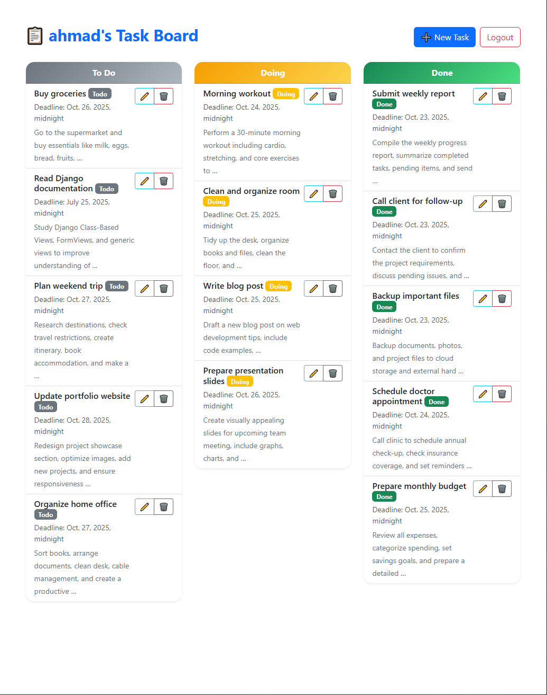

# Django Task Manager

A simple **Task Management System** built with **Python & Django**, allowing users to create, update, and delete tasks, manage deadlines, and track progress.  
Perfect for personal task organization or as a backend project demo.

---

## 📝 Features

- User authentication: Signup, Login, Logout  
- Create, Update, Delete tasks  
- Task status: To Do, Doing, Done  
- Deadline tracking  
- User-specific task lists  
- Responsive UI with Bootstrap  
- Clean and organized templates  

---

## 🛠 Technologies & Tools

- **Backend:** Python, Django, Django REST Framework  
- **Frontend:** HTML, Bootstrap, JavaScript  
- **Database:** SQLite / PostgreSQL  
- **Other Tools:** Git, GitHub  

---

## 🚀 Installation

1. Clone the repository:

```bash
git clone https://github.com/mohammadaminbagheri/django-task-manager.git

Navigate to the project folder:
    cd django-task-manager

Create a virtual environment:
    python -m venv venv
    venv\Scripts\activate

Install dependencies:
    pip install -r requirements.txt

Run migrations:
    python manage.py migrate

Start the development server:  
    python manage.py runserver


🎯 Usage
    Go to http://127.0.0.1:8000/ in your browser
    Signup or Login
    Create, edit, and manage your tasks


🖼 Screenshots
    


📌 License

This project is licensed under the MIT License.